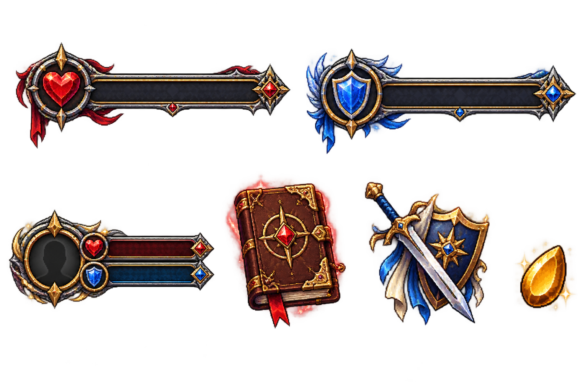

# CalabazaTales

CalabazaTales is an event-driven MMORPG foundation for [PumpkinMC](https://github.com/Pumpkin-MC/Pumpkin). It ships as a Rust/WASM plugin plus original Java and Bedrock resource packs with a dark steel, gold, crimson, and sapphire medieval-anime HUD.



## Included in v0.1.0

- Java inventory GUI and native Bedrock forms for quests and attributes.
- 50 sequential TOML quests across mining, collecting, and killing, from level 1 to 89.
- Persistent player levels, XP, unspent points, and four attributes: Damage, Defense, Speed, and Vitality.
- Dragon Seed currency with the symbol `Ds`.
- Inclusive X/Y/Z cuboid safe zones that can separately prevent block breaking, block placement, and PvP.
- A live target boss bar with target health and an armor estimate.
- Original health, armor, and target-bar artwork for Java 26.2 and Bedrock.
- Event-driven operation with no repeating scheduler.

## Install

1. Download `CalabazaTales.wasm`, `CalabazaTales-Java-26.2.zip`, and/or `CalabazaTales-Bedrock.mcpack` from the latest release.
2. Put `CalabazaTales.wasm` in Pumpkin's `plugins` folder.
3. Start Pumpkin once. The plugin creates `plugins/data/CalabazaTales/config.toml`, `quests.toml`, `safe_zones.toml`, and `players/`.
4. Install the Java ZIP as a resource pack or import the `.mcpack` in Bedrock.
5. Run `/tales` in game.

Pumpkin can also offer both packs from direct download URLs through `[resource_pack.java]` and `[resource_pack.bedrock]` in `pumpkin.toml`; a ready-to-merge example is in [`docs/pumpkin-resource-packs.toml`](docs/pumpkin-resource-packs.toml). See [Pumpkin's resource-pack configuration](https://docs.pumpkinmc.org/config/resource-pack). The Java pack uses resource-pack format `88`, the format published for Minecraft Java 26.2 in the [official 26.2 technical notes](https://feedback.minecraft.net/hc/en-us/articles/46690753273997-Minecraft-Java-Edition-26-2). The Bedrock manifest follows Microsoft's [resource-pack manifest reference](https://learn.microsoft.com/en-us/minecraft/creator/reference/content/addonsreference/packmanifest?view=minecraft-bedrock-stable).

## Commands

- `/tales` or `/tales quests` — open the quest journal.
- `/tales attributes` or `/tales stats` — open character attributes.
- `/tales reload` — validate and reload all TOML configuration; requires `calabazatales.command.admin`.

Permissions:

- `calabazatales.command.tales` — allowed by default.
- `calabazatales.command.admin` — permission level 3 operators by default.

## Quest authoring

Quests live in a separate `quests.toml`. Add another `[[quests]]` entry and run `/tales reload`:

```toml
[[quests]]
id = "q51"
title = "A New Tale"
description = "Mine cinnabar for the royal alchemist."
difficulty = "Legendary"
required_level = 90
prerequisite = "q50"
reward_xp = 50000
reward_ds = 9000
objective = { kind = "mine", target = "minecraft:cinnabar", amount = 256 }
```

Supported objective kinds are `mine`, `collect`, and `kill`. Targets are namespaced identifiers. Quest IDs must be unique, amounts must be positive, and prerequisites must exist; invalid configuration is rejected without replacing the running setup.

## Safe-zone authoring

Safe zones live in `safe_zones.toml`. Every coordinate is inclusive and Y is fully bounded:

```toml
[[zones]]
id = "capital"
display_name = "The Capital"
world = "minecraft:overworld"
min_x = -128
max_x = 128
min_y = -64
max_y = 320
min_z = -128
max_z = 128
block_break = true
block_place = true
pvp = true
```

## Progression

XP is earned from mining, collecting, kills, and quest claims. The level curve, point grants, and attribute scaling are configured in `config.toml`. Damage and Defense modify direct entity combat, Speed changes walk speed, and Vitality changes maximum health. Player state is atomically persisted as JSON after meaningful changes.

## Edition notes

The game logic is edition-neutral. Java uses container GUIs; Bedrock uses the native form API exposed by Pumpkin. Boss bars and normal HUD state are translated by Pumpkin. The two packs are separate because Java and Bedrock use different UI asset layouts.

Current kill attribution covers direct player damage. Projectile-owner attribution is planned because Pumpkin's current plugin event surface does not expose a projectile owner on the damage event. Safe-zone PvP prevention applies to player-versus-player damage; environmental and mob damage remain enabled.

## Build

```powershell
rustup target add wasm32-wasip2
cargo build --release --locked
./scripts/build_assets.ps1
./scripts/package.ps1
```

The plugin targets `wasm32-wasip2` and pins the Pumpkin API revision used for the release. Source art and the deterministic asset generator are included so every HUD file can be rebuilt.

## License

MIT. The generated HUD is an original CalabazaTales design inspired by the broad anime-fantasy MMORPG genre; it does not copy Sword Art Online artwork or branding.
